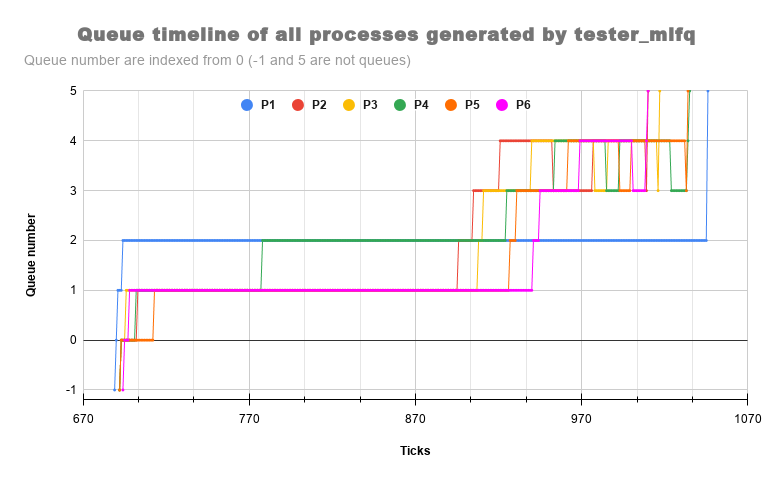

# **Modifying xv6**
# How to run
    -> make clean
    -> make qemu-nox SCHEDULER=[FLAG]
FLAG  = RR,FCFS,PBS,MLFQ by default flag is RR
# Testfiles
|file|cmd|description|
|:---:|:-:|:---:|
|setPriority.c|setPriority <*new_priority*> <*pid*>|to change priority of process with given pid|
|time.c|time <*process*>| to  check waitx|
|tester.c| tester |for running with time as "time tester" <br/> tester contains benchmark.c|
|tester_ps.c| tester_ps | tester + getps()|
|tester_pbs.c|tester_pbs|to check PBS scheduling|
|tester_mlfq.c|tester_mlfq|to check MLFQ scheduling|
# Task 1 
## waitx
+ added ctime,etime,rtime,iotime in proc sturcture in proc.h file
+ here is final extended proc struct
```
struct proc {
  uint sz;                     // Size of process memory (bytes)
  pde_t* pgdir;                // Page table
  char *kstack;                // Bottom of kernel stack for this process
  enum procstate state;        // Process state
  int pid;                     // Process ID
  struct proc *parent;         // Parent process
  struct trapframe *tf;        // Trap frame for current syscall
  struct context *context;     // swtch() here to run process
  void *chan;                  // If non-zero, sleeping on chan
  int killed;                  // If non-zero, have been killed
  struct file *ofile[NOFILE];  // Open files
  struct inode *cwd;           // Current directory
  char name[16];               // Process name (debugging)
  int iotime;                  // sleep time
  int rtime;                   // total run time 
  int ctime;                   // creation time
  int etime;                   // end time
  int waitshh;
  int priority;
  int num_run;
  int qticks[5];
  int tempa;
  int queue;
  int curr_ticks;
  int change_q;
  int enter;
  int pbs_yield_flag;
};
```
+ initialize basic terms when process is created in `allocproc` function in proc.c
```
static struct proc*
allocproc(void)
{
    ...
    p->ctime = ticks; 
	p->etime = 0;
	p->rtime = 0;
	p->iotime = 0;
	p->waitshh = -1282128;
    p->num_run = 0;
	p->priority = 60; // default
  	#ifdef MLFQ
		p->curr_ticks = 0;
		p->queue = 0;
		p->enter = 0;
		for(int i=0; i<5; i++)
			p->qticks[i] = 0;
	#endif
    ...
}
```
+ udpated etime(exit time) in `exit` function in proc.c
```
void
exit(void)
{
  ...
  curproc->state = ZOMBIE;
  curproc->etime = ticks;
  ...
}
```

+ created a function `ticking` to update ticks for all procs in proc.c and accessed in trap.c
    - proc.c
        ```
        void ticking(){
            for(struct proc *p=ptable.proc; p<&ptable.proc[NPROC]; ++p){
                if(p->state == RUNNING){
                    p->rtime++;
                }
            if(p->state == SLEEPING){
                    p->iotime++;
                }
            }
        }
        ```

    - trap.c
        ```
        void
        trap(struct trapframe *tf)
        {
            ...
            case T_IRQ0 + IRQ_TIMER:
            if(cpuid() == 0){
            acquire(&tickslock);
            ticks++;
            wakeup(&ticks);
            release(&tickslock);
            ticking();
            }
            lapiceoi();
            break;
            ...
        }
        ```
+ after updating all fields required for waitx, added same code oa wait but added 2 more line
 ```
 int
waitx(int *wtime, int *rtime)
{
    ...
      if(p->state == ZOMBIE){
        // Found one.
        *rtime = p->rtime ;
				*wtime = p->etime - p->ctime - p->rtime - p->iotime;
        pid = p->pid;
        kfree(p->kstack);
    ...
}

```

+ **Test file** > time.c ; **cmd** `time <process>`

## ps
+ extended struct proc in proc.h mentioned in `waitx` part
+ **System call** > set_getps in sysproc.c
    ```
    int sys_getps(void)
    {
        return getps();
    }
    ```
+ **User call** > getps in proc.c
    ```
    int
    getps(void) 
    {
        struct proc *p;
        int ret = -1;
    acquire(&ptable.lock);
    #ifndef MLFQ
    cprintf("Name\tPID\tPriority    State \tr_time\tw_time\ts_time\n");
    #endif
    #ifdef MLFQ
    cprintf("Name\tPID\tPriority    State \tr_time\tw_time\ts_time\tn_run\tcur_q\t q0\tq1\tq2\tq3\tq4\n");
    #endif
    for (p = ptable.proc; p < &ptable.proc[NPROC]; ++p)
    {
        #ifndef MLFQ
        if (p->state == SLEEPING)
        {
        cprintf("%s \t %d \t %d \t   SLEEPING \t %d \t %d \t %d\n", p->name, p->pid, p->priority, p->rtime, ticks - p->ctime - p->rtime -p->iotime,p->iotime);
        }
        else if (p->state == RUNNING)
        {
        cprintf("%s \t %d \t %d \t   RUNNING  \t %d \t %d \t %d\n", p->name, p->pid, p->priority, p->rtime, ticks - p->ctime - p->rtime -p->iotime,p->iotime);
        }
        else if (p->state == RUNNABLE)
        {
        cprintf("%s \t %d \t %d \t   RUNNABLE \t %d \t %d \t %d\n", p->name, p->pid, p->priority, p->rtime, ticks - p->ctime - p->rtime -p->iotime,p->iotime);
        }
        else if (p->state == ZOMBIE)
        {
        cprintf("%s \t %d \t %d \t    ZOMBIE \t %d \t %d \t %d\n", p->name, p->pid, p->priority, p->rtime, p->etime - p->ctime - p->rtime -p->iotime,p->iotime);
        }
        #endif

        #ifdef MLFQ
    if (p->state == SLEEPING)
        {
        cprintf("%s \t %d \t %d \t   SLEEPING \t %d \t %d \t %d \t %d \t %d \t %d \t %d \t %d \t %d \t %d\n", p->name, p->pid, p->priority, p->rtime, ticks - p->ctime - p->rtime -p->iotime,p->iotime,p->num_run,p->queue,p->qticks[0],p->qticks[1],p->qticks[2],p->qticks[3],p->qticks[4]);
        }
        else if (p->state == RUNNING)
        {
        cprintf("%s \t %d \t %d \t   RUNNING  \t %d \t %d \t %d \t %d \t %d \t %d \t %d \t %d \t %d \t %d\n", p->name, p->pid, p->priority, p->rtime, ticks - p->ctime - p->rtime -p->iotime,p->iotime,p->num_run,p->queue,p->qticks[0],p->qticks[1],p->qticks[2],p->qticks[3],p->qticks[4]);
        }
        else if (p->state == RUNNABLE)
        {
        cprintf("%s \t %d \t %d \t   RUNNABLE \t %d \t %d \t %d \t %d \t %d \t %d \t %d \t %d \t %d \t %d\n", p->name, p->pid, p->priority, p->rtime, ticks - p->ctime - p->rtime -p->iotime,p->iotime,p->num_run,p->queue,p->qticks[0],p->qticks[1],p->qticks[2],p->qticks[3],p->qticks[4]);
        }
        else if (p->state == ZOMBIE)
        {
        cprintf("%s \t %d \t %d \t    ZOMBIE \t %d \t %d \t %d \t %d \t %d \t %d \t %d \t %d \t %d \t %d\n", p->name, p->pid, p->priority, p->rtime, p->etime - p->ctime - p->rtime -p->iotime,p->iotime,p->num_run,-1,p->qticks[0],p->qticks[1],p->qticks[2],p->qticks[3],p->qticks[4]);
        }
        #endif

    }
    release(&ptable.lock);
        return ret;
    }
    ```

# Task 2
## RR
+ it is already present as default in xv6
## FCFS
+ adding in scheduler.c
    + finding a new process with min `p->ctime`
        ```
        for (p = ptable.proc; p < &ptable.proc[NPROC]; p++)
		{
			if (p->state != RUNNABLE)
				continue;

			if (to_run_proc == 0)
				to_run_proc = p;
			else if (p->ctime < to_run_proc->ctime)
				to_run_proc = p;
		}  
        ```
    + removed in trap.c
        ```
        #ifndef FCFS
            yield();
        #endif
        ```
## PBS
+ adding in scheduler.c
    + finding a new process with min `p->priority` and if proiority is same then min `p->ctime`
        ```
        for (p = ptable.proc; p < &ptable.proc[NPROC]; p++)
        {
            if (p->state != RUNNABLE)
                continue;	

            if (to_run_proc == 0)
                to_run_proc = p;
            
            else if (p-> priority < to_run_proc-> priority)
            {
                if(p-> priority == to_run_proc-> priority)
                {
                    if(p->ctime < to_run_proc->ctime){
                    to_run_proc = p;
                    }
                }
                else
                {
                    to_run_proc = p;
                }
            }
		}
        ```
+ also made a syscall `sys_set_priority` in sysproc.c and `set_priority` in proc.c

    + 
        ```
        int sys_set_priority(void)
        {
        int pid, priority;

        if (argint(0, &pid) < 0)
            return -1;

        if (argint(1, &priority) < 0)
            return -1;
        
        return set_priority(pid, priority);
        }
    + 
        ```
        int set_priority(int pid, int priority)
        {
            struct proc *p;
            int to_yield = 0, old_priority = 0;

            for (p = ptable.proc; p < &ptable.proc[NPROC]; p++)
            {
                if(p->pid == pid)
                {
                    to_yield = 0;
                    acquire(&ptable.lock);
                    old_priority = p->priority;
                p->priority = priority;
                    cprintf("Changed priority of process with PID %d from %d to %d\n", p->pid, old_priority, p->priority);
                    if (old_priority > p->priority)
                        to_yield = 1;
                    release(&ptable.lock);
                    break;
                }
            }
            if (to_yield == 1)
            yield();
            return old_priority;
        }
## MLFQ
+ some supporting functions used for MLFQ
    - adding a process `p` in queue `q_no`
        ```
        int add_proc_to_q(struct proc *p, int q_no)
        {	
        // checking queue
            for(int i=0; i < q_tail[q_no]; i++)
            {
                if(p->pid == queue[q_no][i]->pid)
                    return -1;
            }
            // cprintf("Process with PID %d added to Queue %d\n", p->pid, q_no);
            p->enter = ticks;
            p -> queue = q_no;
            q_tail[q_no]++;
            queue[q_no][q_tail[q_no]] = p;
            return 1;
        }
        ```
    - removing a process `p` from queue `q_no`
        ```
        int remove_proc_from_q(struct proc *p, int q_no)
        {
            int proc_found = 0, rem = 0;
            for(int i=0; i <= q_tail[q_no]; i++)
            {
                if(queue[q_no][i] -> pid == p->pid)
                {
                    // cprintf("Process with PID %d found in Queue %d\n", p->pid, q_no);
                    rem = i;
                    proc_found = 1;
                    break;
                }
            }
            if(proc_found  == 0)
            {
                // cprintf("ERROR : REMOVE_Q : no Process with pid %d found in Queue %d\n", p->pid, q_no);
                return -1;
            }
            for(int i = rem; i < q_tail[q_no]; i++)
            queue[q_no][i] = queue[q_no][i+1]; 
            q_tail[q_no] -= 1;
            // cprintf("Process with PID %d is removed from Queue %d\n", p->pid, q_no);
            return 1;
        }
        ```
        - for checking a change of queue is required 
        ```
        void change_q_flag(struct proc* p)
        {
            acquire(&ptable.lock);
            p-> change_q = 1;
            release(&ptable.lock);
        }
        ```
        - for updating curr_tick of a process 
        ```
        void incr_curr_ticks(struct proc *p)
        {
            acquire(&ptable.lock);
            p->curr_ticks++;
            p->qticks[p->queue]++;
            release(&ptable.lock);
        }
        ```
+ if curr_ticks in a queue > q_ticks_max_value of it moves a queue downward code in trap.c
    ```		
        if(myproc()->curr_ticks >= q_ticks_max[myproc()->queue])
        {
            change_q_flag(myproc());
            // cprintf("Process with PID %d on Queue %d yielded out as ticks completed = %d\n", myproc()->pid, myproc()->queue, myproc()->curr_ticks);
            yield();
        }

        else 		
        {
            incr_curr_ticks(myproc());
            // cprintf("Process with PID %d continuing on Queue %d with current tick now being %d\n", myproc()->pid, myproc()->queue, myproc()->curr_ticks);
        }
    ```	
+ when age of a process is more than 30 it move a queue upward for removing starvation problem code in proc.c
    ```
    for(int i=1; i < 5; i++)
    {
        for(int j=0; j <= q_tail[i]; j++)
        {
            struct proc *p = queue[i][j];
            int age = ticks - p->enter;
            if(age > 30)
            {
                remove_proc_from_q(p, i);
                // cprintf("Process %d moved up to queue %d due to age time %d at %d\n", p->pid, i-1, age, ticks);
                add_proc_to_q(p, i-1);
            }
        }
    }
    ```


# Comparision

+ for `time tester` (waitx) command wtime and rtime includes only running and waiting time for `time` process not for fork running in it thats why i printed there individual finishing time (total time)  

    * RR <br/>
    <br/>
    * FCFS <br/>
    <br/>
    * PBS <br/>
    <br/>
    * MLFQ <br/>
    <br/>
        
+ although wtime, rtime and total_time for `time tester` in each scheduling are mentioned below
    | flag| wtime | rtime | s_time |total_time|
    |-----|:---:|:--:|:--:|:-:|
    | RR | 3 | 17|24355|2455|
    | FCFS | 5 | 1|4220|4226|
    | PBS | 6 | 15|2422|2444|
    | MLFQ | 5 | 1|2404|2410|
    *total time = waiting_time + running_time + sleeping_time*

+ order on basis of finishing time
    ```
    FCFS >> RR > PBS > MLFQ
    ```
    a huge difference in FCFS and other is due to non-preemitive implementation in FCFS

+ FCFS has largest finishing time as there is no preemption and if a process with larger time comes first all the rest processes have to starve for cpu execution.

+ PBS and RR have almost same finishing time. In PBS is any two and more processes are given same priority then they would also act as FCFS but with preemption and in RR after every particular time slice so not process would starve for CPU. Thus, both have less finishing time is than FCFS.

+ MLFQ has the least time as there are many queues with different priorities and a process which takes more CPU time is shifted to less priority queue and also prevents starvation by aging i.e shifting to upper queues after some fixed time. Thus, it takes the least time.

# Question
+ As asked in point 5 of procedure, If a process voluntarily relinquishes control of the CPU, it leaves the queuing network, and when the process becomes ready again after the I/O, it is inserted at the tail of the same queue, from which it is relinquished earlier. This can be exploited by a process, as just when the time-slice is about to expire, the process can voluntarily relinquish control of the CPU, and get inserted in the same queue again. If it ran as normal, then due to time-slice getting expired, it would have been preempted to a lower priority queue. The process, after exploitation, will remain in the higher priority queue, so that it can run again sooner that it should have. In the other words a process can ensure
to remain in higher priority queue by increasing the number of I/O processes (for example printing garbage on the terminal).

# BONUS 😊
+ graph for running `tester_mlfq`
	
    - here Queue number `-1` means process is not started yet and not present in any queue
   
    - here Queue number `5` means process is finished and not present in any queue
    
    - `P1` : is parent process 
    
    - `P[i]` : if (i-1)th child process of P1
    
    - look at graph in google sheet <a href="https://docs.google.com/spreadsheets/d/1Dnkm6cngu2IZWQG7na88abIMkkvPYsIs3mpoYt9Ic-0/edit?usp=sharing">here</a> for better comparision
    
+ there is no graph with process `init` and `sh`

    + reason: getting this as ouput when printing logs for queue swaping, which is must to collect data to create graph 
    ```
	    lapicid 0: panic: acquire
	    80104f31 801007c2 80103a05 80103a9f 8010472f 80100a25 80102794 8010648f 80106264 8010301f
    ```

# Summary
+ files changed
    + proc.c
    + proc.h
    + trap.c
    + defs.h
    + syscall.c
    + syscall.h
    + sysproc.c
    + user.h
    + usys.S
+ added testers files
    + time.c
    + tester.c
    + tester_ps.c
    + tester_pbs.c
    + tester_mlfq.c
    + setPriority.c
+ README.md
    + code description
+ REPORT.md
    + question asked
    + graph
+ Others 
    + graph_log_unfilter.txt 
    + graph_log.txt
    + graph.png 
    + RRt.png
    + FCFSt.png
    + PBSt.png
    + MLFQt.png

