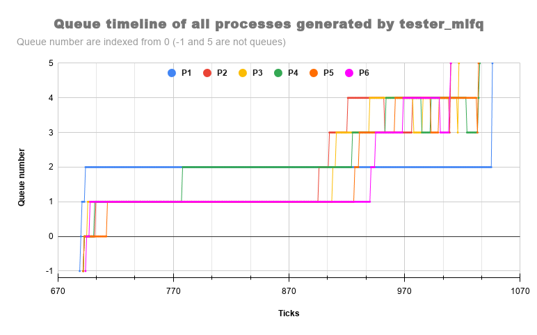

# Comparision

+ for `time tester` (waitx) command wtime and rtime includes only running and waiting time for `time` process not for fork running in it thats why i printed there individual finishing time (total time)  

    * RR <br/>
    <br/>
    * FCFS <br/>
    <br/>
    * PBS <br/>
    <br/>
    * MLFQ <br/>
    <br/>
        
+ although wtime, rtime and total_time for `time tester` in each scheduling are mentioned below
    | flag| wtime | rtime | s_time |total_time|
    |-----|:---:|:--:|:--:|:-:|
    | RR | 3 | 17|24355|2455|
    | FCFS | 5 | 1|4220|4226|
    | PBS | 6 | 15|2422|2444|
    | MLFQ | 5 | 1|2404|2410|
    *total time = waiting_time + running_time + sleeping_time*

+ order on basis of finishing time
    ```
    FCFS >> RR > PBS > MLFQ
    ```
    a huge difference in FCFS and other is due to non-preemitive implementation in FCFS

+ FCFS has largest finishing time as there is no preemption and if a process with larger time comes first all the rest processes have to starve for cpu execution.

+ PBS and RR have almost same finishing time. In PBS is any two and more processes are given same priority then they would also act as FCFS but with preemption and in RR after every particular time slice so not process would starve for CPU. Thus, both have less finishing time is than FCFS.

+ MLFQ has the least time as there are many queues with different priorities and a process which takes more CPU time is shifted to less priority queue and also prevents starvation by aging i.e shifting to upper queues after some fixed time. Thus, it takes the least time.

# Question
+ As asked in point 5 of procedure, If a process voluntarily relinquishes control of the CPU, it leaves the queuing network, and when the process becomes ready again after the I/O, it is inserted at the tail of the same queue, from which it is relinquished earlier. This can be exploited by a process, as just when the time-slice is about to expire, the process can voluntarily relinquish control of the CPU, and get inserted in the same queue again. If it ran as normal, then due to time-slice getting expired, it would have been preempted to a lower priority queue. The process, after exploitation, will remain in the higher priority queue, so that it can run again sooner that it should have. In the other words a process can ensure
to remain in higher priority queue by increasing the number of I/O processes (for example printing garbage on the terminal).

# BONUS 😊
+ graph for running `tester_mlfq`

    - here Queue number `-1` means process is not started yet and not present in any queue
    - here Queue number `5` means process is finished and not present in any queue
    - `P1` : is parent process 
    - `P[i]` : if (i-1)th child process of P1
    - look at graph in google sheet <a href="https://docs.google.com/spreadsheets/d/1Dnkm6cngu2IZWQG7na88abIMkkvPYsIs3mpoYt9Ic-0/edit?usp=sharing">here</a> for better comparision
+ there is no graph with process `init` and `sh`
    + reason: getting this as ouput when printing logs for queue swaping, which is must to collect data to create graph 
    ```
    lapicid 0: panic: acquire
    80104f31 801007c2 80103a05 80103a9f 8010472f 80100a25 80102794 8010648f 80106264 8010301f
    ```

# Summary
+ files changed
    + proc.c
    + proc.h
    + trap.c
    + defs.h
    + syscall.c
    + syscall.h
    + sysproc.c
    + user.h
    + usys.S
+ added testers files
    + time.c
    + tester.c
    + tester_ps.c
    + tester_pbs.c
    + tester_mlfq.c
    + setPriority.c
+ README.md
    + code description
+ REPORT.md
    + question asked
    + graph
+ Others 
    + graph_log_unfilter.txt 
    + graph_log.txt
    + graph.png 
    + RRt.png
    + FCFSt.png
    + PBSt.png
    + MLFQt.png

